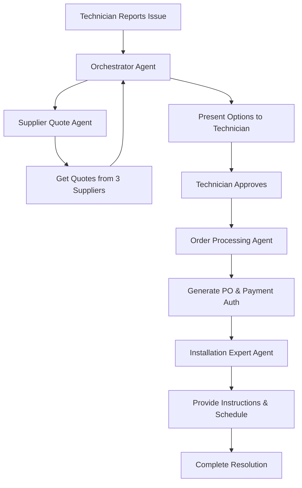

# 🏭 Factory Inventory Management System

A sophisticated multi-agent system built with the Inkeep Agents SDK for managing factory component replacements. The system orchestrates multiple AI agents to handle supplier quotes, order processing, and installation guidance.

## 🌟 Features

- **Multi-Agent Architecture**: Coordinated system with specialized agents for different tasks
- **Real-time Supplier Quotes**: Automatically contacts multiple suppliers for competitive pricing
- **Order Processing**: Generates purchase orders and payment authorizations
- **Installation Guidance**: Provides detailed installation instructions and safety guidelines
- **Maintenance Scheduling**: Offers preventive maintenance schedules for components
- **Beautiful Web Interface**: Modern, responsive UI for factory technicians

## 🤖 Agent Architecture

### 1. **Inventory Orchestrator Agent** (Main Coordinator)
- Manages the entire workflow
- Coordinates between other agents
- Handles user interactions
- Provides status updates

### 2. **Supplier Quote Agent**
- Contacts three different suppliers
- Compares prices and delivery times
- Recommends best options based on urgency
- Handles quote negotiations

### 3. **Order Processing Agent**
- Generates purchase orders
- Prepares payment authorizations
- Handles approval workflows
- Manages order documentation

### 4. **Installation Expert Agent**
- Provides step-by-step installation instructions
- Emphasizes safety procedures
- Offers maintenance schedules
- Estimates installation time and required resources

## 🚀 Getting Started

### Prerequisites

- Node.js 22+
- pnpm 10+
- OpenAI API Key (for GPT-5-nano-2025-08-07)

### Installation

1. Clone the repository:
```bash
cd inventory-management-system
```

2. Install dependencies:
```bash
pnpm install
```

3. Configure your OpenAI API key:
```bash
# Add to .env file (create if it doesn't exist)
OPENAI_API_KEY=your-api-key-here
```

### Running the System

1. Start the development servers:
```bash
pnpm dev
```

2. The system will be available at:
- Management API: http://localhost:3002
- Runtime API: http://localhost:3003
- Visual Builder: http://localhost:3000

3. Push the agents to the platform:
```bash
cd src/inventory-system
inkeep push
```

4. Test the agents locally:
```bash
inkeep chat
```

5. Launch the web interface:
```bash
cd src/inventory-system
npm run serve
```
Then open http://localhost:8080 in your browser.

## 💬 Usage Examples

### Reporting a Broken Component

**Technician**: "The MOTOR-X500 on production line 3 has failed. I need a replacement urgently."

**System Response**:
1. Acknowledges the urgent request
2. Contacts all three suppliers for quotes
3. Presents pricing and delivery options
4. Processes the order upon approval
5. Provides installation instructions
6. Sets up maintenance schedule

### Available Components

The system currently supports these components:
- **MOTOR-X500**: Industrial Motor (Critical)
- **BEARING-Z200**: Heavy Duty Bearing
- **PUMP-H300**: Hydraulic Pump
- **VALVE-V100**: Control Valve
- **SENSOR-S800**: Temperature Sensor

## 🔧 Configuration

### Model Settings

The system uses OpenAI's GPT-5-nano-2025-08-07 model with optimized settings for each agent:

```typescript
models: {
  base: {
    model: "openai/gpt-5-nano-2025-08-07",
    providerOptions: {
      temperature: 0.5,  // Varies by agent
      maxOutputTokens: 2048
    }
  }
}
```

### Supplier Configuration

Suppliers and their catalogs are configured in `tools/inventory-tools.ts`. Each supplier has:
- Unique pricing for components
- Different delivery times
- Complete catalog coverage

## 🛠️ Development

### Project Structure

```
inventory-system/
├── index.ts                 # Main project entry
├── inkeep.config.ts         # Inkeep configuration
├── graphs/
│   └── inventory-management.ts  # Agent graph definition
├── tools/
│   └── inventory-tools.ts      # MCP tools for agents
├── config/
│   └── api-config.ts           # API configuration
├── web/
│   └── index.html              # Web interface
└── README.md                   # Documentation
```

### Adding New Components

1. Update the supplier catalogs in `tools/inventory-tools.ts`
2. Add installation instructions to the database
3. Update the web interface component list

### Customizing Agents

Each agent can be customized by modifying:
- Prompt instructions
- Temperature settings
- Available tools
- Delegation permissions

## 🔒 Security Notes

**Important**: 
- Never commit API keys to version control
- Use environment variables for sensitive data
- Implement proper key rotation in production
- Add rate limiting for API calls
- Monitor usage and costs

## 📊 Sample Workflow



## 🤝 Contributing

1. Fork the repository
2. Create a feature branch
3. Commit your changes
4. Push to the branch
5. Open a Pull Request

## 📝 License

This project is for demonstration purposes. Ensure you have proper licensing for production use.

## 🆘 Support

For issues or questions:
- Check the Inkeep documentation: https://docs.inkeep.com
- Review the agent logs in the development console
- Contact the development team

## 🎯 Future Enhancements

- [ ] Integration with real supplier APIs
- [ ] Database persistence for orders
- [ ] Email/SMS notifications
- [ ] Predictive maintenance using historical data
- [ ] Multi-language support
- [ ] Mobile application
- [ ] Integration with existing ERP systems
- [ ] Advanced analytics dashboard

---

Built with ❤️ using the Inkeep Agents SDK
